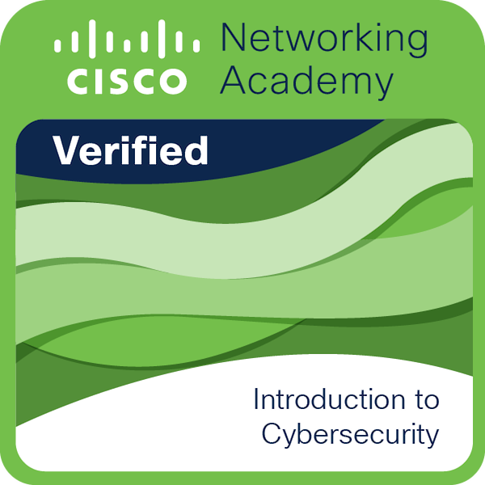
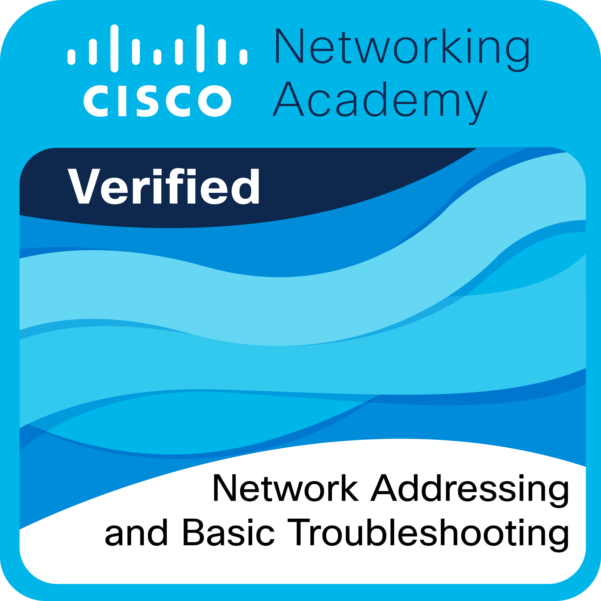

<!-- Banner Image -->
 

<!-- Arrow -->

  

  

  

I’m a passionate developer specializing in <strong>Artificial Intelligence</strong> and <strong>Cyber Security</strong>. I enjoy leveraging cutting-edge technologies to solve complex problems and am constantly looking to expand my knowledge and skills in AI, cybersecurity, and machine learning.

## 🌱 Current Focus:
- **Artificial Intelligence**: Building AI models for automation and predictive insights.
- **Cybersecurity**: Creating AI-driven security solutions.
- **Data Science**: Uncovering trends and insights from large datasets.

## 📜 Certifications & Achievements:
- **Infosec Python for Cybersecurity Specialization**  
  - Topics: Active Defense, Credential Access, Digital Forensics.
  
- **EC-Council Cybersecurity Attack & Defense Fundamentals Specialization**  
  - Covered Ethical Hacking, Network Defense, and Digital Forensics.
  
- **Capture The Flag (CTF) Participant**  
  - Solved cryptography, forensics, reverse engineering, and web exploitation challenges.

## 💼 Featured Projects & Contributions:

### 🔒 **Cybersecurity Projects**:
1. **[Infosec Python for Cybersecurity Specialization](https://github.com/cyberfantics/python-for-cybersecurity)**  
   - Developed tools for **Command-and-Control**, **Exfiltration**, and **Credential Access**.

2. **[VirusTotal File Scanner](https://github.com/cyberfantics/virus-total-scanner)**  
   - Flask application that integrates with **VirusTotal API** to scan files and retrieve reports.

3. **[picoCTF Challenges](https://github.com/cyberfantics/picoCTF-challenges)**  
   - Solutions to challenges from the picoCTF competition.

## 🔧 Tech Skills:
- **Programming Languages**: Python, JavaScript, C++
- **Tools**: Flask, Git, BeautifulSoup, Seaborn, Selenium
- **Cybersecurity Tools**: Metasploit, Wireshark, Burp Suite, SQLMap
- **Databases**: MySQL
- **AI/ML Frameworks**: TensorFlow, Keras, Scikit-learn

## 📥 Download My CV:

  

## 📊 GitHub Stats

    
    

## 🛠️ Contribution Activity

    
     
    

## 🏆 Trophies

## 🏅 Badges:
<!--First Row-->

  
  
    

<!-- Second Row-->

  
  
  
  
  

<!-- Third Row -->

  

## 🛠 Recent Workflows:
- 🌐 Scraping Book Info from Amazon using BeautifulSoup
- 📊 Visualizing Data Trends with Seaborn
- 🛡️ Flask-based Web App for VirusTotal API Integration
- 🔐 Developing AI-driven Cybersecurity Models

## 🤝 Get in Touch:

  
  
  
  
  
  
  
  

😄 **Pronouns**: He/Him  
⚡ **Fun Fact**: I have a knack for solving **challenging CTF puzzles**!

