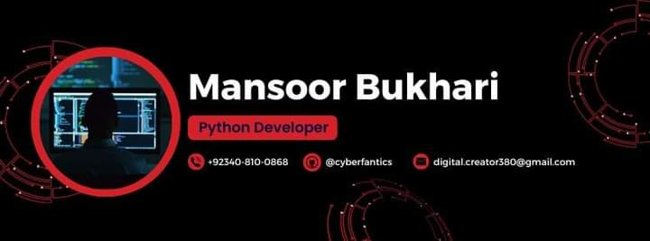

# Hi, I'm [Syed Mansoor ul Hassan Bukhari](https://github.com/cyberfantics)! 👋

I’m passionate about **Artificial Intelligence** and **Cyber Security**. Currently, I’m diving deep into the world of AI and its intersections with cybersecurity, constantly learning and applying cutting-edge techniques to real-world problems.

---

## 👨‍💻 About Me:
- 🎓 I'm pursuing an advanced specialization in **Artificial Intelligence** and **Cyber Security**.
- 🔒 I’ve completed several courses and certifications in **Cybersecurity** and **Digital Forensics**.
- 🎯 I’m always on the lookout for opportunities to contribute to exciting projects in **AI**, **Machine Learning**, and **Cybersecurity**.
- 💡 **Fun Fact**: I enjoy solving **Capture The Flag (CTF)** puzzles in my free time!

---

## 🌱 What I’m Currently Learning:
- 🤖 **Advanced AI**: Building complex models for automation and predictive analytics.
- 🛡️ **Cybersecurity Practices**: Focusing on AI-powered security solutions.
- 📊 **Data Science**: Working on large datasets to extract actionable insights.

---

## 💼 Projects & Contributions:
Here are some of the projects I’m working on:
1. **[Artificial Intelligence Course Repository](https://github.com/cyberfantics/AI-Course)** - My complete journey through AI with lecture files, notes, and practice tasks.
2. **[Cybersecurity Specialization Certificates](https://github.com/cyberfantics/cybersecurity-certificates)** - Showcasing my completion of multiple cybersecurity and digital forensics certifications.

---

## 💬 Get in Touch:
- 📫 Reach out to me on **[LinkedIn](https://www.linkedin.com/in/mansoor-bukhari-77549a264/)** for collaboration or networking.
- 🌐 You can also explore my **[GitHub](https://github.com/cyberfantics)** repositories for more projects and contributions.
- 📧 Feel free to email me at **[digital.creator380@gmail.com](mailto:digital.creator380@gmail.com)** for any inquiries.

---

## 💼 Skills:
- **Languages**: Python, JavaScript, Bash
- **Frameworks**: Flask, TensorFlow, Scikit-learn
- **Tools**: BeautifulSoup, Selenium, Jupyter, Tkinter
- **Cybersecurity**: Network Defense, Ethical Hacking, Digital Forensics
- **AI/ML**: Data Analysis, Machine Learning, Natural Language Processing

---

## 🌟 Achievements & Certifications:
1. **Infosec Python for Cybersecurity Specialization** - 100% in 3 courses.
2. **EC-Council Cybersecurity Attack & Defense Fundamentals Specialization**.
3. **Google Cybersecurity Certificate**.

---

## 📈 GitHub Stats:

---

😄 **Pronouns**: He/Him  
⚡ **Fun Fact**: I have a knack for solving challenging **CTF** puzzles!
